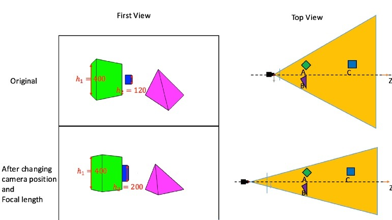
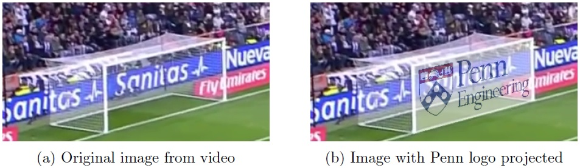
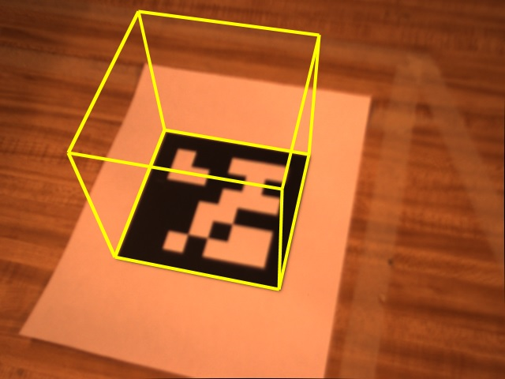

# Robotics-Perception

## 1. Dolly Zoom
We will implement Dolly Zoom effect used by film-makers to create a sensation of vertigo, a "falling-away-from-oneself" feeling. 
This is meant to introduce the concepts of projection and focal length. It keeps the size of an object of interests constant
in the image, while making the foreground and background objects appear larger or smaller by adjusting focal length and moving 
the camera. We will simulate the Dolly Zoom effect with a synthetic scene as shown in figure below, which illustrates two cubes 
and one pyramid seen from the top view.

More details can be found [here](https://github.com/2wavetech/Robotics-Perception/blob/master/Dolly%20Zoom/Robotics%20Perception%20Dolly%20Zoom.pdf).

## 2. Projection Geometry and Homography
We will use the concepts of projective geometry and homographies to allow us to project an image onto a scene in a natural way that respects perspective. To demonstrate this, we will project our logo onto the goal-gate in the images from a video sequence of a football match, as well as the corners of the goal in each image and an image of the Penn Engineering logo. The task is, for each image in the video sequence, compute the homography between the Penn logo and the goal, and then warp the goal points onto the ones in the Penn logo to generate a projection of the logo onto the video frame.

More details can be found [here](https://github.com/2wavetech/Robotics-Perception/blob/master/Projective%20Geometry/Robotics%20Perception%20Image%20Projection.pdf).

## 3. Augmented Reality (AR)
We will use tracking and pose estimation to implement a simple augmented reality application. There will be two steps to this process. First, we will use a KLT tracker to get the position of corners across different frames. Then we will use homography estimation to compute the 3D pose of a set of 4 points in the world and, instead of simply overlaying a logo like in the previous assignment, render a 3D object in the frame. For simplicity we will be rendering a cube, but in principle, any object could be used. Below are a few example images of the results in 1. The goal will be to from a set of 4 projected points on your image with known coordinates (the AprilTag or Soccer goal corners), find the necessary position and orientation to draw the cube over the points.

More details can be found [here](https://github.com/2wavetech/Robotics-Perception/blob/master/Image%20Projection%202%20AR/Robotics%20Perception%20Augmented%20Reality.pdf).
